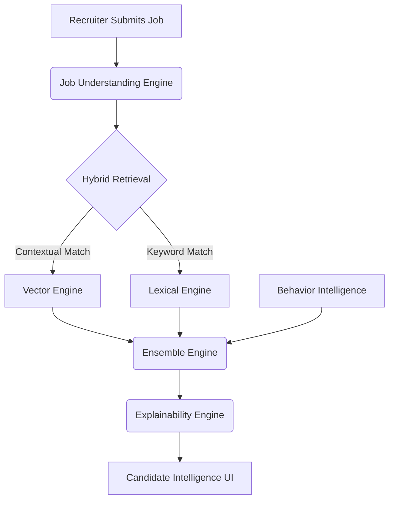

<div align="center">
  
  <h1 align="center">Hiretica</h1>
  <p align="center">
    <strong>Enterprise-Grade AI Recruiting Agent & Pipeline</strong>
  </p>
  <p align="center">
    <a href="https://opensource.org/licenses/MIT"></a>
    <a href="https://github.com/maheshmm7/Hiretica/pulls"></a>
    
    
  </p>
  <p align="center">
    <a href="#overview">Overview</a> •
    <a href="#features">Features</a> •
    <a href="#architecture">Architecture</a> •
    <a href="#installation">Installation</a> •
    <a href="#api-overview">API</a>
  </p>
</div>

---

## 📌 Project Overview
Hiretica is an advanced AI-powered recruiting pipeline that automates the evaluation, ranking, and explainability of engineering candidates. Built for scale, it fuses Contextual AI with Precise Keyword Scoring and behavioral heuristics to rank candidates exactly how a senior technical recruiter would.

## 🎯 Problem Statement
Traditional ATS platforms rely on rigid keyword matching, frequently missing qualified candidates who use different terminology (e.g., "React.js" vs "React"). Conversely, modern pure-LLM approaches often hallucinate or fail on exact technical requirements. Recruiters need a hybrid approach that accurately understands both context and strict technical mandates, paired with explainable AI that generates actionable, human-readable insights.

## 💡 Solution
Hiretica implements a multi-stage **Hybrid AI Ranking Engine**. It evaluates candidates based on technical fitness, behavioral signals, and contextual relevance, providing a deterministic and explainable score. The platform translates complex vector math into recruiter-friendly insights ("Contextual Match Engine") so hiring managers can trust the decisions.

---

## 🚀 Features
- **Mission Control Dashboard**: Real-time observability of the AI pipeline, sub-system health checks, and active job requisitions.
- **Job Understanding**: LLM-driven parsing of unstructured job descriptions to extract required technologies, domain context, and core responsibilities.
- **Hybrid Retrieval**: Parallel processing utilizing a Contextual Vector Engine (for semantic understanding) and a Keyword Search Engine (for exact-match technical requirements).
- **Behavior Intelligence**: Signals derived from Redrob datasets, identifying open-source contributions, market validation, and recruiter engagement histories.
- **Ensemble Engine**: A normalization and weighting layer that fuses technical and behavioral scores into a deterministic ranking.
- **Explainable AI**: An Evidence Translation Layer that converts backend metrics into natural, recruiter-friendly executive summaries and actionable recommendations.

---

## 🏗️ Architecture Diagram



## ⚙️ AI Pipeline Workflow
1. **Ingestion**: Recruiter inputs a Job ID and Description.
2. **Extraction**: The system extracts hard skills, soft skills, and required experience levels.
3. **Scoring**: Candidates are scored simultaneously on contextual relevance and exact-keyword presence.
4. **Behavioral Analysis**: Profiles are boosted or penalized based on real-world signals (e.g., active GitHub profile, rapid career progression).
5. **Synthesis**: Scores are normalized and weighted (Technical vs. Behavioral).
6. **Translation**: The AI generates a recruiter-friendly Executive Summary, highlighting key strengths and potential concerns.

---

## 🛠️ Technology Stack
### Frontend
- **Framework**: Next.js 14 (App Router)
- **Language**: TypeScript
- **Styling**: Tailwind CSS & Radix UI
- **State Management**: Zustand
- **Animations**: Framer Motion

### Backend
- **Framework**: FastAPI (Python 3.12)
- **ML / AI**: HuggingFace Transformers (SentenceTransformers), scikit-learn
- **Data**: Pandas, NumPy
- **Testing**: Pytest

---

## 📂 Repository Structure

```text
hiretica/
├── backend/                  # FastAPI backend
│   ├── api/                  # REST endpoints
│   ├── core/                 # Core configuration and pipeline orchestration
│   ├── ensemble/             # Score normalization and weighting
│   ├── explainability/       # Natural language reason generation
│   ├── intelligence/         # Behavior and heuristic logic
│   ├── retrieval/            # Vector and Lexical search engines
│   └── tests/                # Pytest suite
├── frontend/                 # Next.js frontend
│   ├── src/app/              # Next.js App Router pages
│   ├── src/components/       # Reusable UI components
│   └── src/lib/              # Utilities and state management
├── dataset/                  # Mock candidate data and schemas
├── docs/                     # Project documentation and archives
└── scripts/                  # Utility and setup scripts
```

---

## 🚀 Deployment (Render)

To keep the GitHub repository lightweight, large ML artifacts (FAISS indexes, pre-computed embeddings) are **not** committed to version control. The backend is configured to dynamically download these artifacts upon startup in a production environment.

### 1. Prepare the Cache Archive
1. On your local machine where the app runs successfully, navigate to the `cache/` directory.
2. Select all files *inside* the `cache/` directory (`bm25.pkl`, `faiss.index`, `*.parquet`, `*.npy`) and zip them into an archive named `cache.zip`. **Do not zip the `cache` folder itself**, just its contents.
3. Upload `cache.zip` to a reliable storage provider (e.g., AWS S3, Google Cloud Storage, or a direct Dropbox link).
4. Copy the direct download URL.

### 2. Configure Render
Create a new **Web Service** on Render and configure it exactly as follows:
- **Environment:** `Python 3`
- **Root Directory:** `backend`
- **Build Command:** `pip install -r requirements.txt`
- **Start Command:** `uvicorn main:app --host 0.0.0.0 --port 10000`

### 3. Environment Variables
Add the following Environment Variable in your Render dashboard:
- `CACHE_ARCHIVE_URL`: Set this to the direct download URL of your `cache.zip` from Step 1.

*Note: Render's Free tier limits RAM to 512MB. Because Hiretica loads transformer models and vector search indexes into memory, you will likely need to upgrade to a paid instance with at least 1GB–2GB of RAM to prevent Out-Of-Memory (OOM) crashes.*

---

## 💻 Installation

### Prerequisites
- Node.js (v18+)
- Python (3.11+)
- Git

### 1. Backend Setup
```bash
cd backend
python -m venv venv
source venv/bin/activate  # On Windows: .\venv\Scripts\activate
pip install -r requirements.txt
uvicorn main:app --reload
```
The backend will run at `http://localhost:8000`.

### 2. Frontend Setup
```bash
cd frontend
npm install
npm run dev
```
The frontend will run at `http://localhost:3000`.

### Environment Variables
For demonstration purposes, Hiretica runs entirely locally. Ensure the backend URL is correctly configured in your frontend (default: `http://localhost:8000`).

---

## 🔌 API Overview
Hiretica exposes a clean REST API:
- `GET /health` - System health check
- `POST /api/v1/workspace` - Initialize a new AI recruiting pipeline
- `GET /api/v1/workspace/{job_id}/status` - Stream pipeline status
- `GET /api/v1/workspace/{job_id}/candidates` - Retrieve ranked candidates and explanations

---

## 🧪 Testing & Code Quality
Hiretica strictly adheres to enterprise engineering standards.
- **Backend**: `black`, `isort`, `flake8`, `mypy`, and `pytest`.
- **Frontend**: `eslint` and Next.js strict build constraints.

To run the backend test suite:
```bash
cd backend
pytest
```

---

## 🔮 Future Scope
- Integration with live ATS APIs (Greenhouse, Workable).
- Real-time GitHub and StackOverflow data scraping.
- Conversational AI (Chatbot) for recruiters to query the candidate pool naturally.

---

## 📄 License
This project is licensed under the MIT License - see the LICENSE file for details.

---
*Built with precision for the modern technical recruiter.*
